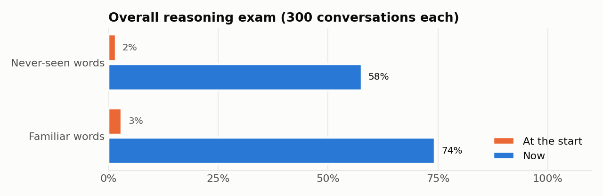

# Pip: a baby LLM to raise

If I had a baby, it would be small, earnest, and a little too curious. It would keep every word you give it, glow when you stay, and grow a mind only from your voice.

This is that baby: a 17-million-parameter language model, trained from scratch on children's stories, that lives in a little nursery in your browser. There's no cloud AI: everything runs on your own computer. You feed it, rock it to sleep, dress it up, talk with it and teach it, and it reasons about what you've taught it instead of just memorizing.



*At the start it could only tell random stories (2% on the reasoning exam). Now it answers from what you taught it, including about words it never saw in training (58%). See the [full analysis](analysis/REPORT.md).*

## Quick start

```bash
pip install torch tokenizers datasets
python app.py
```

The nursery opens in your browser automatically. If another program already uses port 8765, the baby picks the next free port (8766, 8767…) and prints the address, so use the address shown in the terminal. Name your baby and click once anywhere (browsers keep pages silent until you do).

| Command | What it does |
|---|---|
| `python app.py` | Opens the nursery with the baby's neural brain (http://localhost:8765, or the next free port; `--port` to choose, `--no-browser` to not open a tab) |
| `python grow.py` | Helps the baby learn more: reads about 450,000 new stories streamed from the internet (nothing stored), practices conversations, and only keeps the result if it's better. About 14 h on a laptop CPU; Ctrl+C pauses, and running it again resumes |
| `python chat.py` | Talk in the terminal: `/teach <fact>`, `/feed`, `/cuddle`, `/nap`, `/memory` |
| `python analysis/run_analysis.py` | Re-measures the baby against how it started (about 15 min) |

Opening `index.html` directly also works, but then the baby runs on simple rules only. The chat header shows **rules only** instead of **🧠 neural brain**.

## In the nursery

- **Feed:** a bottle with draining milk, sucking cheeks, a bib, then *burp*. A full baby turns its head away.
- **Rock and nap:** rocking a tired baby sends it to sleep. At night the lights dim, a nightcap appears and Zzz float up. Sleep refills in real time and the baby wakes on its own, or cries if woken too early.
- **Cuddle and touch:** tap to tickle, hold to cuddle, stroke the head to pat. Its eyes follow your cursor.
- **Peekaboo:** hands over eyes, then "boo!" and a belly laugh.
- **Closet:** onesie colors and patterns, hats (bunny ears, crown, sun hat…), extras (binky, glasses, bow tie, scarf), or 🎲 surprise me.
- **Feelings and sounds:** real recorded baby cries, laughs and giggles, plus coos and babble. The baby cries when very hungry or lonely; comforting it calms it down. It talks in a small voice with baby talk ("I wuv you") that fades as it grows.
- **Talk and teach:** "Biscuit is a dog." "A dog says woof." Later: "What does Biscuit say?" → "Biscuit is a dog, so Biscuit says woof!" Ask about something it was never taught and it says it doesn't know yet.

Your baby is saved in `saves/baby.json` in the project folder: name, memories, chat, outfit and needs, only a few KB, with the previous version kept as `baby.json.bak`. It's the same baby whichever port, tab or browser you open. The browser keeps a copy too, which is used when `index.html` is opened directly without `app.py`.

## How it learns (and why it doesn't just memorize)

A model this small can't safely cram new facts into its own weights one sentence at a time. It would overwrite what it knew and mostly memorize wording. So learning is split in two:

1. **Memory.** What you teach goes into the Memory Bank. For each message, the app finds the facts that matter and shows them to the model.
2. **Reasoning over memory** is the trained skill. The baby practiced on about 60,000 freshly generated conversations ([sft_data.py](sft_data.py)), each used once and thrown away, most of them full of invented words. Memorizing answers was impossible, so it had to learn the skills: look facts up, chain two facts, flip I/you, accept corrections, remember what it said itself, follow up on your answers, and admit when it doesn't know.

At runtime, [chat.py](chat.py) adds a few honesty checks around the model:
- It catches made-up words.
- It repairs clipped names.
- It fact-checks answers about memory.
- It answers name questions directly.
- It checks "you said…" claims against what the baby actually said.

Progress is always measured on **words the baby never saw in training**, so the score reflects understanding, not memory. The full before/after story is in [analysis/REPORT.md](analysis/REPORT.md).

## Help it grow

```bash
python grow.py                  # ~13 h reading + ~1.5 h conversation practice
python grow.py --tokens 300M    # read for longer
python grow.py --skip-reading   # only redo the conversation practice
```

1. **Reading:** it streams TinyStories (a pool of ~2 million stories) from Hugging Face, learns from each story once, and discards it. The default reads about 450,000 of them. No dataset piles up on disk, and nothing repeats, so there's nothing to memorize. It continues from the current brain.
2. **Practice:** fresh conversations, generated as it goes.
3. **Health check:** the new brain takes the same exam as the current one, using words neither has seen. It only replaces the current brain if it scores higher, so growing never makes the baby worse.

## Share it with everyone

Anyone can visit, name their own baby and raise it, for free. The baby's brain runs **inside each visitor's browser** (a 17 MB download, once), so there's no server to pay for, any number of people can play at once, and nothing they say leaves their device. Each baby is saved in its visitor's browser, and 💾 / 📂 back it up or move it to another device.

**GitHub Pages** (this repository): Settings → Pages → *Deploy from a branch* → `main` / `(root)` → Save. A minute later it's live at `https://<username>.github.io/babyLLM/`. On a free GitHub plan this needs a *public* repository. For a private one, use Hugging Face instead.

**Hugging Face** (free static Space):

```bash
hf auth login                                          # once, with a "write" token
python deploy/make_space.py --push YOUR_NAME/baby-llm
```

After retraining the brain, rebuild the browser version and publish again:

```bash
python deploy/export_web.py    # checkpoints/baby_chat.pt -> web/baby.onnx (needs onnx + onnxruntime)
```

Prefer a server? `python app.py --public`, or `python deploy/make_space.py --docker` for any Docker host. In server mode:
- Only the nursery's own files are served.
- Each visitor gets at most 30 replies a minute.
- Nothing is stored.

In every mode, babies won't learn or repeat rude words.

**How babies grow when shared:** each baby grows from its own caregiver through its memory, its age stage and its fading baby talk. The shared brain does *not* learn from strangers' chats, which keeps one person's rude or private words out of everyone else's baby. It grows when you run `grow.py`, re-export it and publish.

## Train from scratch

```bash
python prepare_baby_data.py      # download TinyStories, train the tokenizer, save compact token files
python train.py                  # learn language (or: python train.py --stream, storing nothing)
python sft.py                    # learn conversation + reasoning over memory -> checkpoints/baby_chat.pt
python sft.py --eval-only --init checkpoints/baby_chat.pt   # take the reasoning exam
```

## Project map

| Path | What's inside |
|---|---|
| [index.html](index.html), [css/](css/), [js/nursery.js](js/nursery.js) | The nursery: the baby, care, closet, sounds, chat |
| [app.py](app.py), [chat.py](chat.py) | Web server and the brain's runtime (memory retrieval + honesty checks) |
| [train.py](train.py) | The model (a GPT-style transformer with fast generation) and language training |
| [stream_train.py](stream_train.py), [grow.py](grow.py) | Learning from streamed stories; the one-command growth routine |
| [sft_data.py](sft_data.py), [sft.py](sft.py) | Practice-conversation generator, conversation training and the reasoning exam |
| [prepare_baby_data.py](prepare_baby_data.py) | Dataset download and tokenizer training |
| `checkpoints/` | `baby_chat.pt` (the brain used by the app) and `baby_model_best.pt` (its story-reading base) |
| `saves/` | `baby.json`: your baby (memories, chat, outfit, needs) |
| [analysis/](analysis/) | Before/after measurements, charts and the report |
| [web/](web/) | The brain for browsers: `baby.onnx` (int8, 17 MB), the tokenizer and reply logic in JavaScript |
| [deploy/](deploy/) | `export_web.py` (brain → browser format), `make_space.py` (build/publish the public version) |
| [sounds/](sounds/) | Baby sound clips ([credits](sounds/CREDITS.md)) |

## Where it could go: BabyLM

[BabyLM](https://babylm.github.io/) is a research challenge about the same idea: language models that learn from a child-sized amount of language. Our baby is already at about that scale, and BabyLM now allows learning from a teacher's feedback, much like our caregiver. The [analysis report](analysis/REPORT.md#5-could-our-baby-enter-babylm-someday) explains what it would take to enter a future round.

## Credits

- Training stories: [TinyStories](https://huggingface.co/datasets/roneneldan/TinyStories) (Eldan & Li, 2023).
- Baby sounds: Pixabay contributors, used under the Pixabay Content License. Details in [sounds/CREDITS.md](sounds/CREDITS.md).
