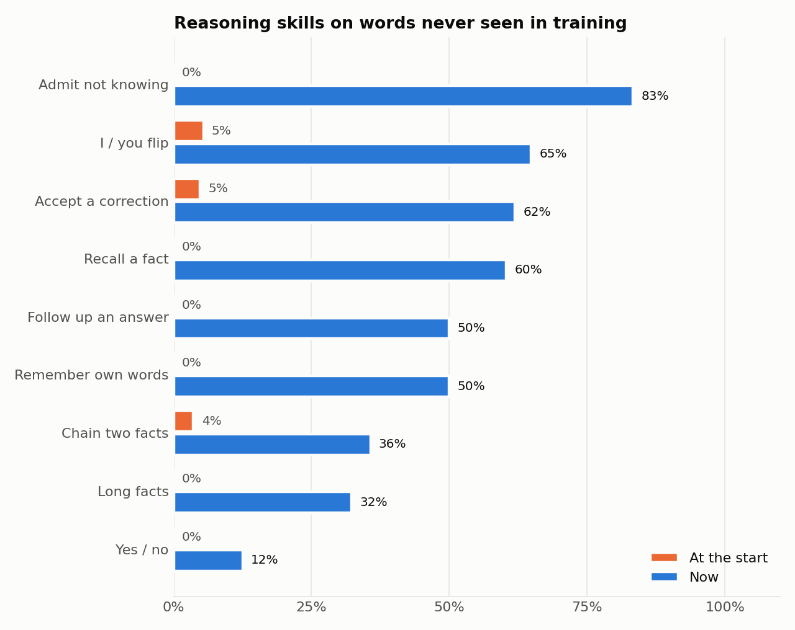

# How the baby grew: before and after

*Measured 8 October 2026 with [`run_analysis.py`](run_analysis.py). Raw numbers are in [`results.json`](results.json).*

## In one minute

| | At the start | Now |
|---|---|---|
| Reasoning exam, words it has **seen** in training | 3% | **74%** |
| Reasoning exam, words it has **never seen** | 2% | **58%** |
| Real nursery situations answered correctly (14 situations × 3 tries) | 2% (1 of 42) | **100%** (42 of 42) |
| Reply speed | 31 tokens/s | **199 tokens/s** (6.5× faster) |
| Brain file size | 197 MB | **65 MB** |
| Whole project on disk | 400 MB | **161 MB** |

"At the start" is the brain as it was when this work began. It was a model that had only ever read children's stories, used the way the original app used it. "Now" is today's brain together with the app's memory and safety checks. Both were tested on identical questions.

## 1. What changed in how it thinks

At the start, the baby had never seen a conversation. Whatever you said, it continued a random story:

| You say | At the start | Now |
|---|---|---|
| Hi! I am your mom. | "Once there was a very obedient little girl who loved to play in the ga…" | "Hello, Yasi! I missed you!" |
| What does Biscuit say? *(taught: Biscuit is a dog; a dog says woof)* | "Once upon a time, there was a little girl named Tar…" | "Biscuit says woof! Because Biscuit is a dog." |
| What are stars? *(taught: Stars are bright suns far away)* | "Once upon a time, there was a girl named Lily…" | "I remember! Stars are bright suns far away!" |
| What is a zebra? *(never taught)* | "Once upon a time, there was a family of four…" | "Ooh, zebra? I don't know yet. Teach me, please!" |
| What is your name? | "Once upon a little girl named Molly was walking…" | "Monika! That's me!" |
| *(it had said "I had a dream about stars")* You said you dreamed about a dog? | "One day, Tom was very excited to go to the park…" | "No! I said: I had a dream about stars." |
| *(it had asked your pet's name)* Biscuit | "Once there was very excited because it was his mommy…" | "Biscuit! I want to meet Biscuit!" |
| *feeds the hungry baby* | "The three year old was a little boy named Jack…" | "Mmm, milk! Yummy yummy. Thank you, Yasi!" |

## 2. Understanding, not memorizing

The exam gives the baby a memory and asks about it. Half the questions use words it practiced with ("familiar"). The other half use words it never saw in training: held-out names, foods and places, plus freshly invented words like "Shuhem is a joji".


The baby can't have memorized answers about words it never saw. So its score on never-seen words measures what it *understands*: reading memory, chaining facts, flipping I/you. The gap between the two rows shows how much is still memorization. That gap was 24 points at the first version and 17 points today, on a much harder exam.



## 3. The journey

Each step was measured on the exam *of its time*. The exam got harder as skills were added (long facts, remembering its own words, following up), so these numbers aren't one smooth curve. The fair before/after comparison is section 2.

| Step | What changed | Familiar | Never-seen | What it showed |
|---|---|---|---|---|
| 0. Start | Story-only model; chat prompt it had never seen | — | 2% | It told stories instead of answering |
| 1. First conversation training | Practice conversations, but a narrow list of names | 70% | 28% | **It was memorizing.** On new words it named names from training ("Foi" for "Quiyix", "Maria" for "Hugo") |
| 2. Broad vocabulary | Thousands of real and invented words, so copying has to be a general skill | 78% | 54% | Real generalization starts |
| 3. Mood-aware care, real-word unknowns | Feeding a hungry baby vs a full baby; "What is a zebra?" | 77% | 62% | Gap 24 → 15 points |
| 4. Free-form facts | Facts like "Stars are bright suns far away" | 73% | 65% | Gap down to 8 points (on a harder exam) |
| 5. Self-consistency | Remembers what *it* said; follows up on your answers | 70% | 61% | Remembering its own words: 0% → 73% |
| Today | Final measurement, hardest exam | 74% | 58% | |

Changes that the exam doesn't capture, because they live around the model:

- **Retrieval and checks** ([chat.py](../chat.py)): the server finds the relevant facts itself. It catches made-up words, repairs clipped names ("Yasam" → "Yasamin"), and fact-checks memory answers. It also answers name questions directly, and checks "you said…" claims against what the baby actually said.
- **Speed and size:** generation that doesn't re-read the whole conversation for every word (6.5×). Conversation training skips work on ungraded words and turns off dropout (2.3 → 1.3 s per step). Brain files are weights-only (197 → 65 MB). Story data is stored compactly (85 → 21 MB).
- **Growing safely** ([grow.py](../grow.py)): it reads about 450,000 more stories by default, streamed and never stored, and only replaces the brain when the new one scores higher.
- **The nursery:** an expressive SVG baby, feeding, sleeping, crying, laughing, real baby sounds, and a closet.

## 4. Honest notes

- **The 14 situations are regression tests, not a fair benchmark.** Most come from bugs you found and we fixed, so passing them shows the fixes hold. The exam in section 2 is the unbiased measure. The single "pass" at the start was luck: a random story happened to mention stars.
- **The exam tests the model alone.** In the app, the safety checks cover many of its weak spots. That's why real situations score 100% while the exam score on never-seen words is 58%.
- **Weakest skills on never-seen words:** yes/no answers (12%), chaining two facts (36%) and long facts (32%). The app's checks protect yes/no about your quotes and long facts. More training (`grow.py`) is the way to improve the model itself.
- **The speed comparison favors the start slightly.** The old method was re-run with today's leaner code, so the real-world speed-up was at least 6.5×.

## 5. Could our baby enter BabyLM someday?

[BabyLM](https://babylm.github.io/) is a research challenge about the same idea as this project: language models that learn efficiently from a child-sized amount of language, instead of the trillions of words big models read.

The current round is **BabyLM 4**, held at EMNLP 2026 in Budapest, October 24–29. Its submission deadlines (July–September 2026) have passed, so our baby could aim for a **future round**, if there is one. Its tracks:

- **Strict-Small** (10 million words) and **Strict** (100 million words), using their provided child-appropriate datasets. A multilingual track also exists.
- At most **10 passes** over the training data.
- This round newly allows **feedback from a teacher model**, close in spirit to how our baby learns from its caregiver.
- Models are scored with the official BabyLM evaluation pipeline and leaderboard. Teams also write a short paper.

How our baby fits:

| | BabyLM | Our baby |
|---|---|---|
| Size of reading | 10M or 100M words | ~10M tokens so far (about 7–8M words), the Strict-Small scale. `grow.py` would add ~75M words |
| Kind of text | Child-appropriate datasets they provide | Children's stories (TinyStories) |
| Learning from a teacher | Now allowed | Built in: the nursery, plus practice conversations |
| Judged on | Language understanding benchmarks | Chatting and reasoning over memory |

To enter, the baby would need to:

1. Relearn its reading from the BabyLM Strict-Small or Strict dataset instead of TinyStories, staying within the word budget and the 10-pass rule.
2. Check how the rules count our generated practice conversations. They are generated text the model reads, so they may count against the word budget.
3. Run the official BabyLM evaluation and publish the model on Hugging Face.
4. Write a short paper about the idea: a model that learns from a caregiver, keeps a memory, and is trained to reason over it instead of memorizing.

Realistically, research teams with GPUs will score higher on the benchmarks. But the challenge is open to newcomers, and an entry about learning through care and conversation fits its spirit well. So it's a realistic project for our baby: not to win, but to take part and learn.

## Re-run this analysis

The numbers above were measured before any `grow.py` run. `grow.py` improves the story-reading base (`baby_model_best.pt`), so on a re-run the "at the start" column means "the story reader without conversation training" rather than the exact original.

```bash
python analysis/run_analysis.py               # about 15 minutes on CPU
python analysis/run_analysis.py --charts-only # just redraw the charts
```
